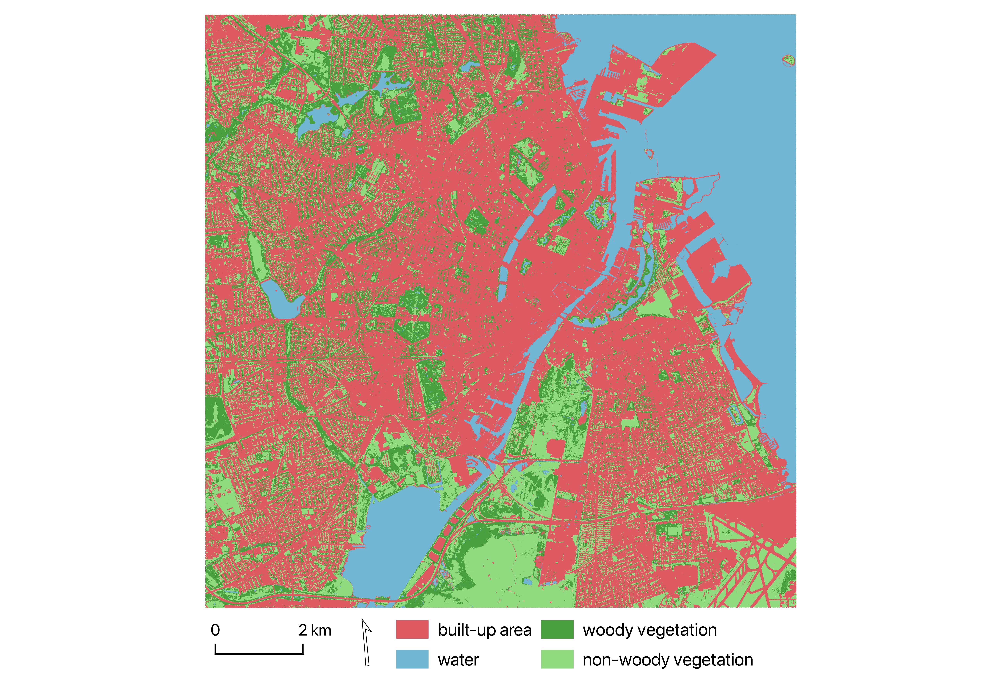

## Classifying Urban Greenery: A Random Forest Approach with PlanetScope Imagery
This project used high-resolution satellite imagery from PlanetScope and Danish Digital Surface Model (DSM) to create a detailed and up-to-date urban land cover classification for Copenhagen, Denmark.

### Repo summary 

```
├── README.md
├── code/
│   ├── UGS_RF_classification.Rmd
└── figs/
    ├── final_classification.png
    └── methods_flowchart.png

```

### Overview of the methodology


### Data
| Dataset name | Spatial resolution | Date |
|--------------|-------------------|------|
| PlanetScope PSB.SD | 3.7 m | 2023-05-30, 2023-07-09, 2023-09-21 |
| Digital Surface Model (DSM) | 0.4 m resampled to 3.7 m | 2016 |

The training data was labelled by the authors with four classes to represent urban land cover: built-up area, water, woody vegetation, and non-woody vegetation.

The test data was generated independently using a random sampling tool in QGIS 3.36.

### Final classification


The project was completed in March 2024.